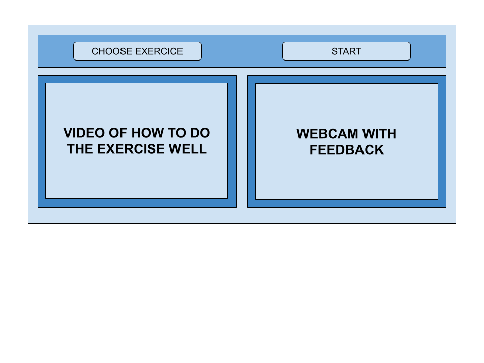

# AudioFeedback_Project

The aim of this project is to create a Python interface that provides interactive audio feedback based on whether or not
a rehabilitation exercise has been successfully completed.

The only file you need to run to see the interface is 'Interface_feedback.py'. 

