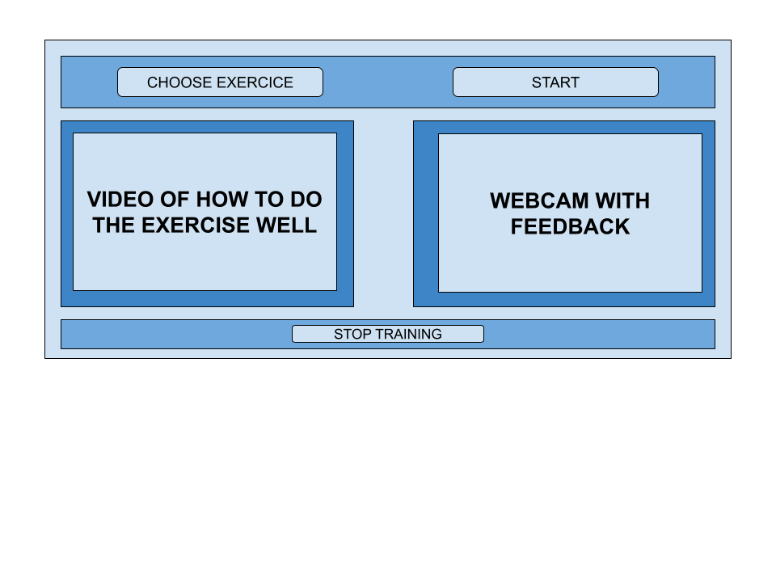

# AudioFeedback_Project

The aim of this project is to create a Python interface that provides interactive audio feedback based on whether or not
a rehabilitation exercise has been successfully completed.

The only file you need to run to see the interface is 'Interface_feedback.py'. 

First, you have to click on **CHOOSE EXERCISE** and select the video of exercise you want to reproduce.

Then, when you click on **START** exercise, you'll be able to reproduce the exercise: on the left-hand screen, you'll be able to watch a physiotherapist doing the exercise you have to reproduce, and at the same time you'll hear a simplified audio commentary explaining the instructions.

If you haven't understood the instructions, you can say *REPEAT*, in which case the interface will repeat the instructions, or *MORE PRECISION*, in which case the interface will give you more precise information on how to perform the exercise.

The window on the right will display the webcam image: depending on the exercise you have chosen, you will be able to get feedback on whether or not you did the exercise correctly. 

For the moment, the most relevant example is the angle calculation. The value of your angle is shown in the top white rectangle and is displayed in green if it's correct or not. You can also say *FEEDBACK* so that the interface gives you feedback on your position.

To find out which features will be viewed on your webcam, you need to complete the document [Instructions](Instructions.xlsx)
 so that for each exercise, only the important features are analysed.
To complete the document, first enter the name of the feature in the '1st feature' column, then the data to be analysed according to the data available (to find out what can be analysed, you can look at the different sheets in the [Instructions](Instructions.xslx) and then the value of the feature.

For now, none of the exercises has really been completed. But you can fill in the document with the help of the document [Features](Features.xlsx) because in the *exercises* sheet all the exercises are listed with the feature to look at for each of them.

Moreover, only the angle, distance and parallelism can be displayed on the screen and may require feedback. It would be necessary to add the code for alignment and calculating the same coordinate in order to be able to use all the necessary features.